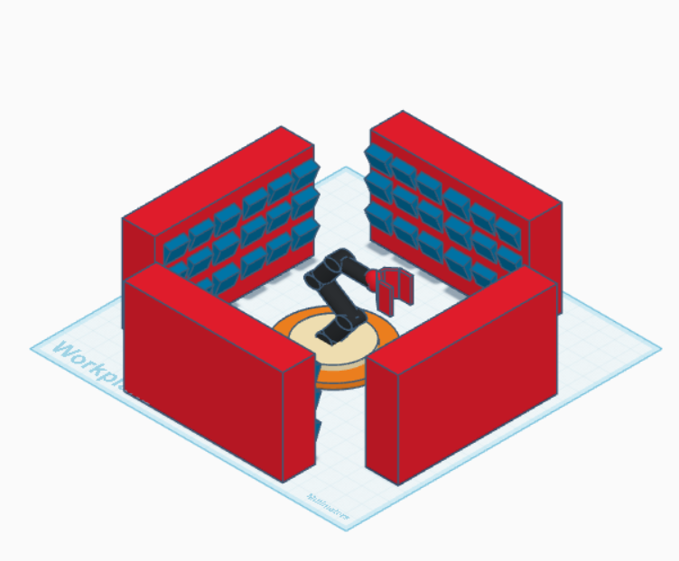

#  3D-Automated-Storage-Robot

This project is a 3D simulation of an automated storage system designed using Tinkercad. It features a robotic arm located at the center of a structured storage layout. The robot is capable of retrieving and placing items in designated storage bins without human intervention.

---

##  Project Overview

- **Tool Used:** Tinkercad (3D Design)
- **Goal:** Automate storage operations using a robotic arm
- **Design:** 4-walled enclosure with stacked storage bins
- **Robot:** Central arm with rotational and vertical reach

---

##  Workspace Definitions

### 1. Working Area
The working area is the internal space of the enclosed storage system, surrounded by four physical walls. Storage bins are placed along all four walls, and the robotic arm is centrally positioned to access them.

- Radius: ~1.5 meters  
- Height: Multiple shelf levels (up to 1.2 meters)  
- Accessible from all four walls with storage bins mounted on each side

---

### 2. Operation Envelope

This defines the maximum 2D horizontal movement range of the robotic arm from its central base. Due to the surrounding structure, the arm's rotation is limited.

- Horizontal rotation: ~270°  
- Maximum reach: Up to the inner edge of the surrounding bins  
- Rotation limited by the back and side walls

---

### 3. Working Envelope
A 3D dome-like volume representing the full space the robotic arm can reach—both horizontally and vertically.

- Includes multiple shelf levels (top, middle, bottom)
- Volume centered around the robotic base  
- Limited vertically by arm height and shelf arrangement

  
---

### 4. Dead Zone
The dead zones are areas that the robotic arm cannot reach due to mechanical or physical limitations.

- Areas behind or directly next to the back corners of the walls  
- Bins placed outside the arm’s rotation arc or vertical limits  
- Any area blocked by structural elements or outside the dome envelope
---

## 🛠️ How to Use

1. Open the `.stl` file in any 3D viewer or Tinkercad.
2. Examine the robotic arm placement and its operational area.
3. Use the design for educational purposes or warehouse automation prototyping.

---

## 📁 Files

- `storage-robotic-arm.png` – Design snapshot  
- `storage-robot.stl` – 3D model export  
- `README.md` – Documentation  

